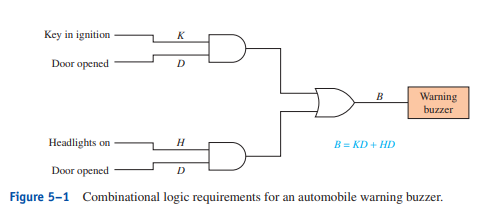
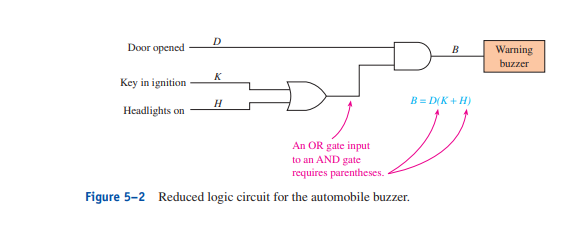
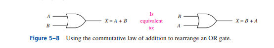
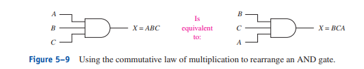
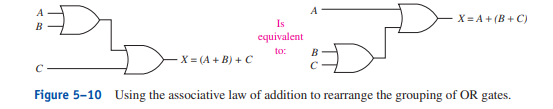
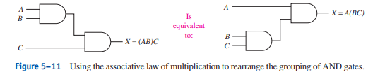
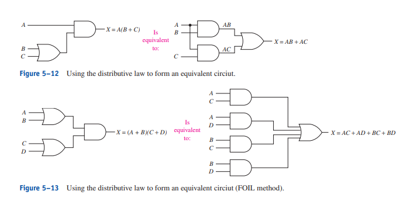
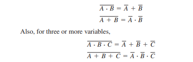

# Combinational Logic

Combinational logic employs using 2 or more of the basic gates to form a complex function.

Example : Form a warning buzzer using combinational logic.
- buzzer activates if the headlighst are on and driver's door is open or if the key is in the ignition and the door is opened.





VHDL <br>
Reduced Logic of Automobile Buzzer
```
LIBRARY ieee;
USE ieee.std_logic_1164.ALL;

ENTITY auto_buzzer IS
    PORT(
        D, K, H : IN STD_LOGIC;
        B : OUT STD_LOGIC);
END auto_buzzer;

ARCHITECTURE arch OF auto_buzzer IS
    BEGIN
        B <= D AND (K OR H);
END arch;
```

# Boolean Algebra Laws and Rules

- Commutative law of addition
    - A + B = B + A


- Commutative law of multiplication
    - AB = BA 


This proves the order of ANDing and ORing doesn't matter

- Associative law of addition
    - A + (B + C) = (A + B) + C
    

- Associative law of multiplication
    - A(BC) = (AB)C
    

This proves that the grouping or several variables ORed and ANDed together doesn't matter.

- Distributive law
    - A(B + C) = AB + AC
    = (A + B)(C + D) = AC + AD + BC + BD

    

This shows the method to expand and shorten equations that are ANDed and ORed together.

# Boolean Algebra Rules and Laws

Rule 1. Anything ANDed with a 0 is equal to 0

Rule 2. Anything ANDED with a 1 is equal to itself

Rule 3. Anything ORed with 0 is equal to itself

Rule 4. Anything ORed with 1 is equal to 1

Rule 5. Anything ANDed with itself is equal to itself.

Rule 6. Anything ORed with itself is equal to itself.

Rule 7. Anything ANDed with its own complement is equal to 0

Rule 8. Anything ORed with its own complement is equal to 1

Rule 9. A variable complemented twice will return to its original logic level. (Example will be like 2 Negatives cancel each other out)

Rule 10. 
- A + (ANOT*B) = A + B
- ANOT + (AB) = ANOT + B

5–1. How many gates are required to implement the following Boolean
equations?

    a. X = (A + B)C
        2 gates
    b. Y = AC + BC
        AC + BC = (A + B)C
        2 gates
    c. Z = (ABC + CD)E
        (ABC + CD)E = (AB + D)CE
        4 gates


5–2. Which Boolean law is used to transform each of the following
equations?

    a. B + (D + E) = (B + D) + E
        Associative law of addition
    b. CAB = BCA
        Commutative law of multiplication
    c. (B + C)(A + D) = BA + BD + CA + CD
        Distributive law

5–3. The output of an AND gate with one of its inputs connected to 1
will always output a level equal to the level at the other input. True or
false?

    True anything AND with 1 is equal to itself.

5–4. The output of an OR gate with one of its inputs connected to 1 will
always output a level equal to the level at the other input. True or false?

    False anything OR with 1 is equal to 1

5–5. If one input to an OR gate is connected to 0, the output will always be
0 regardless of the level on the other input. True or false?

    False anything OR with 0 is equal to itself not 0.

5–6. Use one of the forms of Rule 10 to transform each of the following
equations:

    a. BNOT + AB = ?
        BNOT + AB = BNOT + A
    
    b. B + (BNOT)C = ?
        B + (BNOT)C = B + C

# De Morgan's Theorem

(A*B)NOT = ANOT + BNOT

(A + B)NOT = ANOT * BNOT

(A*B*C)NOT = ANOT + BNOT + CNOT
(A + B + C)NOT = ANOT * BNOT * CNOT



