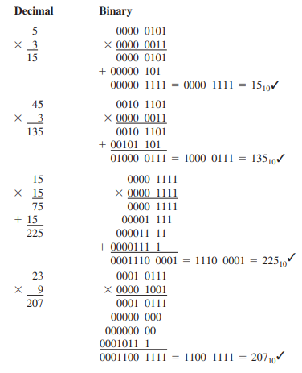
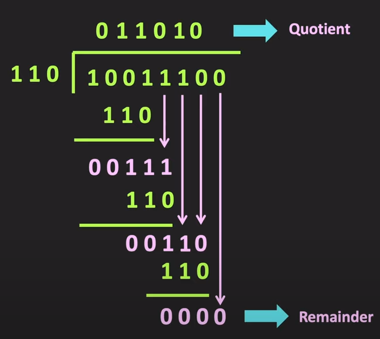

# Binary Arithmetic

## Possible Combination of Addition

- 0 + 0 = 0 Carry 0
- 0 + 1 = 1 Carry 0
- 1 + 0 = 1 Carry 0
- 1 + 1 = 0 Carry 1

## Possible Combination of Subtraction

- 0 - 0 = 0 Borrow 0
- o - 1 = 1 Borrow 1
- 1 - 0 = 1 Borrow 0
- 1 - 1 = 0 Borrow 0

## Procedure for Binary Multiplication

1. Multiply all the top binary digits by the 2^0 bit of the second binary number
2. Multiply all the top binary digits by the 2^1 bit of the second binary numnber and shift the answer one position to the left.
3. Repeat step two for the next 2^X bit until it reaches the very last bit with a value of 1.
4. Add the sum of all the multiplications together.

## Procedure for Binary Division

1. Compare the divisor to the binary of the dividend on the left side where the digits in the divisor equals to dividend.
2. If the divisor is larger than the dividend put a zero and bring the next digit of the dividend down.
3. Once the divisor is smaller than the number bought down from the dividend, do binary subtraction and append a 1 to the solution.
4. Once the divisor is larger than the dividend repeat step 2-3 until the last digit in the divisor is brought down,
5. If after the dividend is finished and the remaining value is 0, there is no remainders. Else whatever the remaining value that is left and smaller than the divisor remains in the dividend becomes the remainder.

# Two's Complement Method

In an 8-bit system postive number is 0000 0000 to 0111 1111. 0 to 127
The negative number will be represented by 1111 1111 to 1000 000. -1 to -128

The maximum positive number is 2^(N-1) - 1.
The maximum negative number is -(2^(N-1))
N = number of bits in the number

# Decimal to Two's Complement Conversion

1. If the decimal number is postivie. The Two's Complement number is the same binary equivalent.

2. If the decimal number is negative, We need to do one's complement to the positive binary number. (Flip all 0 to become 1 and all 1 to become 0). IE : 0001 becomes 1110. Then add a 1 to the one'e complement, so we get the magnitude bit.
The sign bit or the MSB for a neagtive number will always be 1.

# Two's Complement Conversion to Decimal

1. If the number is positive, just do a regular binary to decimal conversion

2. If the number is negative, Do the following steps

    - Do a One's complement and flip all the values around.

    - Add a 1 to the new value got from doing One's complement

    - Do a regular binary to decimal conversion.

# BCD Arthimetic

BCD can only go up to 1001. Thus when doing addition, If the BCD value goes higher than 1001, We need to add 6 or 0110 to the 4 BCD value and move the extra over.

