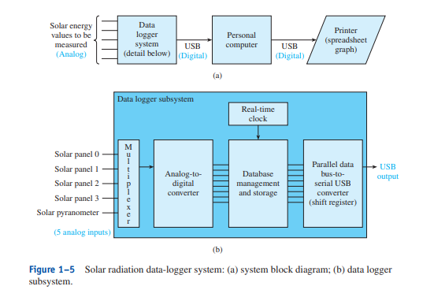

<h1>1-1 Digital Vs Analog</h1>
1-1 List 3 examples of analog quantities
 - Thermometer
 - Ruler
 - Speedometer

1-2 Why do computer systems deal with digital quantities instead of analog quantities

- Ans: because computer system can only read 1s and 0s or only on and off states, so they can only process digital

<h1>1-2 Digital Representations of Analog Quantities</h1>
1–3. Complete the following sentences with the word analog or digital:

    a. Wind speed is an example of a(an) analog quantity?
    b. A music CD contains digital information?
    c. A USB connector transmits digital data?
    d. Hourly outdoor air temperatures exhibit analog variations?

1–4. An automobile speedometer display is (digital, analog, or could be
either) 
- could be either

1–5. An analog-to-digital converter outputs an analog voltage. True or
false? 
- False

1–6. A music CD player is an example of a(n) (ADC or DAC) process?
- DAC

1–7. Electrostatic noise causes more of a problem with which type of signal (analog or digital). Why?
- Analog because analog needs to be precise and accurate. Any small noise can be noticed while in digital, electrostatic noise is either 1 or 0 so small changes won't affect the output

1–8. Figure 1–5 implies that the internal circuitry of a PC can only work
on (digital, analog) signals?
- Digital

1–9. What is the purpose of the multiplexer in Figure 1–5(b)?
- The purpose of the MUX in 1-5 is to allow multiple inputs to be converted to just 1 output

1–10. What is the purpose of the shift register in Figure 1–5(b)?
- The shift register is used to transfer all the data one bit at a time over to the USB output

<h1>1-3 Decimal Numbering System    1-4 Binary Number System </h1>

1–11. Why is the binary numbering system commonly used in digital
electronics?
- Digital electronics can only use digits like 1 and 0s just like the binary numbering system.

1–12. How are the weighting factors determined for each binary position
in a base 2 number?
- The weighting factor for each binary positon is just the power of 2. For example, the 3rd bit counting to the left is 2^2 power.

1–13. Convert 0110 1100 to decimal.
- This will be 4+8+32+64 = 108

1–14. Convert 1101 0110 to decimal
- This will be 2+4+16+64+128 = 204

<h1>1-5 Decimal-to-Binary Conversion</h1>
1–15. Convert 43(10) to binary.
43 will be 101011

1–16. Convert 170(10) to binary
170 will be 10101010

<h1>1-9 Hexadecimal Conversions </h1>
1–22. Why is hexadecimal used instead of the octal numbering system
when working with 8- and 16-bit digital computers?

- Hexadecimal is a 4-bit grouping so it factors well into 8 and 16 bit digital computers. On the other hand, Octal uses 3-bit grouping so it doesn't factor well into 8 and 16 bit digital computers.

1–23. The successive-division method can be used whenever converting from base 10 to any other base numbering system. True or false?
-  True

1–24. Convert 0110 1011(2) to hex.
- 0110 is 6 and 1011 is 11 so B. the hex will be 6B(16)

1–25. Convert E7(16) to binary.
- The E will be 1110.
- The 7 is 0111.
- E7(16) in binary is 1110 0111

1–26. Convert 16C(16) to decimal.
- The 1 is 16*16
- The 6 is 6*16
- The C is 12
- The answer will be 364

1–27. Convert 300(10) to hex
- It will be 16*16 to get 1
- It will be 2*16 to get 2
- It will be 12 to get C
- The answer will be 12C(hex)

<h1> Summary </h1>
In this chapter, we have learned the following:

1. Numeric quantities occur naturally in analog form but must be converted to digital form to be used by computers or digital circuitry.
2. The binary numbering system is used in digital systems because the 1s
and 0s are easily represented by ON or OFF transistors, which output 0 V
for 0 and 5 V for 1.
3. Any number system can be converted to decimal by multiplying each
digit by its weighting factor.
4. The weighting factor of the least significant digit in any numbering system is always 1.
5. Binary numbers can be converted to octal by forming groups of 3 bits
and to hexadecimal by forming groups of 4 bits, beginning with the LSB.
Each group is then converted to an octal or hex digit.
6. The successive-division procedure can be used to convert from decimal
to binary, octal, or hexadecimal.
7. The binary-coded-decimal system uses groups of 4 bits to drive decimal
displays such as those in a calculator.
8. ASCII is used by computers to represent all letters, numbers, and symbols in digital form.