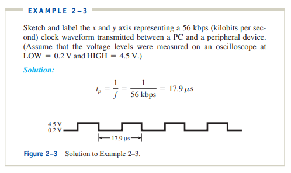
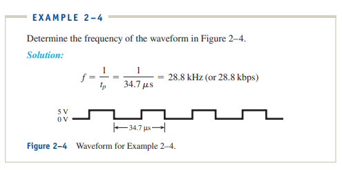

# Digital Signals

Frequency = 1/period

2-1. What is the frequency of a clock waveform whose period is 2 microseconds?

- f = 1/(2 micro) = 0.5 MHz

2-2. A PC manufacturer specifies a microprocessor speed of 4 GHz (Gigahertz).
What is the period of the microprocessor’s waveform?

- period = 1/frequency = 1/4GHz = 250pS

## Review Questions

2–1. What are the labels on the x axis and y axis of a digital signal measured on an oscilloscope?

- The x axis value is the time and the y axis is the voltage

2–2. What is the relationship between clock frequency and clock period?

- 1/period is frequency is 1/frequency is period. Frequency is the amount of time per second each waveform repeats. Period is the number of seconds each repeating waveform takes

2–3. What is the time period from the rising edge of one pulse to the rising
edge of the next pulse on a waveform whose frequency is 8 MHz?

- period = 1/8MHz = 1.25 nano sec

2–4. What is the frequency of a periodic waveform having a period of 50 ns?

- frequency = 1/50 ns = 20 MHz

# Serial Representation
Serial transimission is slow as it can only transmite 1 bit at a time. The best way to speed it up is to use extremely high-speed clock signals.
Serial is cheaper but slower

# Parallel Representation
Parallel format uses a seperate electrical conductor for each bit to be transmitted. This means multiple bits can be transmitted at the same time. Computers transmit data on parallel channels, also known as PCI data bus.
Parallel is more expensive but faster