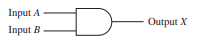
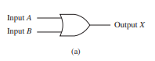
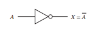
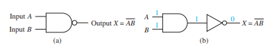
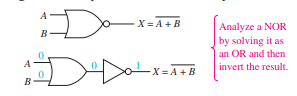

# AND Gate

Truth Table for 2-input And Gate
|A|B|X|
|-|-|-|
|0|0|0|
|0|1|0|
|1|0|0|
|1|1|1|

# OR Gate

Truth Table for 2-input OR Gate

|A|B|X|
|-|-|-|
|0|0|0|
|0|1|1|
|1|0|1|
|1|1|1|

# Inverter

Truth Table for Inverter

|A|X|
|-|-|
|0|1|
|1|0|

# Nand Gate

Truth Table for 2-input NAND Gate

|A|B|X|
|-|-|-|
|0|0|1|
|0|1|1|
|1|0|1|
|1|1|0|

# NOR Gate

Truth Table for 2-input NOR Gate

|A|B|X|
|-|-|-|
|0|0|1|
|0|1|0|
|1|0|0|
|1|1|0|

## Review Questions

3–11. What is the purpose of an inverter in a digital circuit?

- The inverter is to reverse the output of the input. If the output is 0, inverter makes it 1. If the output is 1, inverter makes it 0.

3–12. How does a NAND gate differ from an AND gate?

- NAND gate is different from the AND gate because the NAND gate is an AND gate outputted to an inverter.

3–13. The output of a NAND gate is always HIGH unless all inputs are
made ___________ (HIGH/LOW).

- HIGH

3–14. Write the Boolean equation for a three-input NOR gate.

- NOT(A+B+C)

3–15. The output of a two-input NAND gate is ___________ (HIGH/LOW) if A = 1, B = 0

- HIGH

3–16. The output of a two-input NOR gate is ___________ (HIGH/LOW) if A = 0, B = 1

- LOW