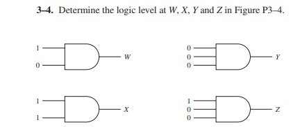
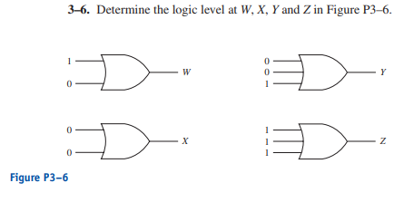
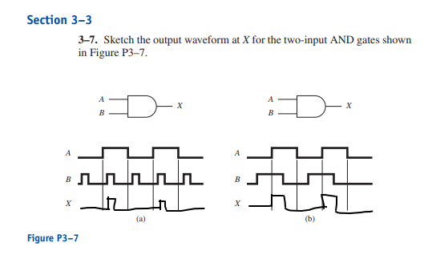

3–1. Build the truth table for:

    (a) a three-input AND gate.
    
|A|B|C|X|
|-|-|-|-|
|0|0|0|0|
|0|0|1|0|
|0|1|0|0|
|0|1|1|0|
|1|0|0|0|
|1|0|1|0|
|1|1|0|0|
|1|1|1|1|

    (b) a four-input AND gate.

|A|B|C|D|X|
|-|-|-|-|-|
|0|0|0|0|0|
|0|0|0|1|0|
|0|0|1|0|0|
|0|0|1|1|0|
|0|1|0|0|0|
|0|1|0|1|0|
|0|1|1|0|0|
|0|1|1|1|0|
|1|0|0|0|0|
|1|0|0|1|0|
|1|0|1|0|0|
|1|0|1|1|0|
|1|1|0|0|0|
|1|1|0|1|0|
|1|1|1|0|0|
|1|1|1|1|1|

3–2. If we were to build a truth table for an eight-input AND gate, how
many different combinations of inputs would we have?

-Answer : it will be 2^8 or 256 inputs

3–3. Describe in words the operation of:

    (a) an AND gate.

        Answer: Combining inputs and making sure the output is high only when all the inputs are high

    (b) an OR gate.

        Answer: Check all the inputs and the output is high if any of the input is high

- W is 0
- X is 1
- Y is 0
- Z is 0

3–5. Write the Boolean equation for

    (a) A three-input AND gate
        X = (A & B & C)
    (b) A four-input AND gate
        X = (A & B & C & D)
    (c) A three-input OR gate
        X = A + B + C

- W = 1
- X = 0
- Y = 1
- Z = 1

