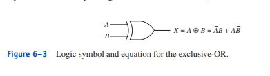
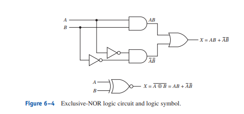

# Exclusive OR Gate Truth Table

X = (ANOT * B) + (A * BNOT)

|A|B|X|
|-|-|-|
|0|0|0|
|0|1|1|
|1|0|1|
|1|1|0|

# Exclusive NOR Gate Truth Table

X = (A * B) + (ANOT * BNOT)

|A|B|X|
|-|-|-|
|0|0|1|
|0|1|0|
|1|0|0|
|1|1|1|

EX-NOR and EX-OR are complements of each other.

## Parity Generator/Checker.

Parity system is to make sure the bits are sent over correctly from one device to another. The parity bit is always the extra bit not part of the answer. Parity system is split into odd parity and even parity. It is to transmit data over to tell the receiving device that the binary info sent over is even or odd. If the second device is expecting an odd number from the parity and receive an even number, it will know that there was a mistake in the transmission due to outside noise and ask the first device to resend the information or output to the user that an error has occur.

One of the best usage of EX-OR and EX-NOR is to be used as a parity generator/checker

## Summary

- EX-OR gate is high when one or the other is high but not when both are high.

- EX-NOR gate is high only when both inputs are high or both inputs are low.