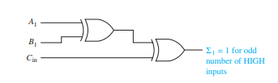
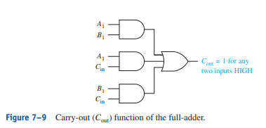
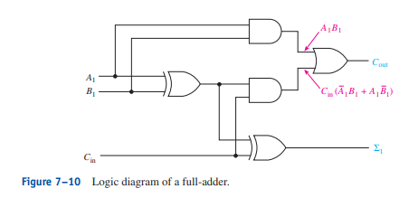

# Arithmetic Circuits

MSI - Medium-scale-integration. This is used for large numbers of circuits.

## Half-Adder

## Full-Adder Sum

## Carry Out

# Full-Adder

Concurrent Statements: Statements that are ran at the same time

For Full-Adder:
- Sum is HIGH for any odd input
- Cout is HIGH when two or more input bits are HIGH