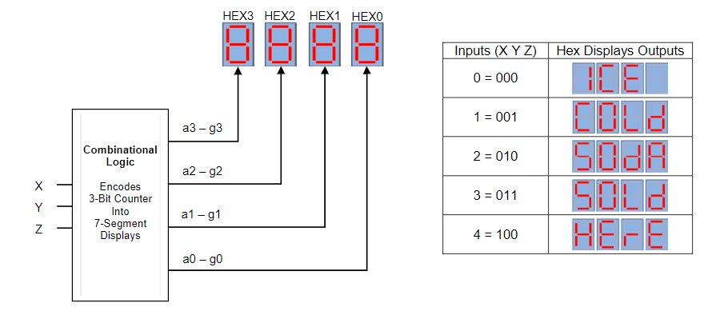

## Objective ##

- Project objective is to gain experience designing complex combinational logic circuits.
- This project will display the message ICE COLd SOdA SOLd HErE on the DE10 Standard Board.
- The design will have 3 inputs (switch buttons) and 28 outputs (SSD)
- Input will be toggled from 0 (000) to 4 (100).

# Project Display

## Create Truth Table for 3 inputs and 4 SSD HEX

|x|y|z| | |a|b|c|d|e|f|g| |a|b|c|d|e|f|g| |a|b|c|d|e|f|g| |a|b|c|d|e|f|g|
|-|-|-|-|-|-|-|-|-|-|-|-|-|-|-|-|-|-|-|-|-|-|-|-|-|-|-|-|-|-|-|-|-|-|-|-|
|0|0|0| |I|1|0|0|1|1|1|1|C|0|1|1|0|0|0|1|E|0|1|1|0|0|0|0|x|1|1|1|1|1|1|1|
|0|0|1| |C|0|1|1|0|0|0|1|O|0|0|0|0|0|0|1|L|1|1|1|0|0|0|1|d|1|0|0|0|0|1|0|
|0|1|0| |S|0|1|0|0|1|0|0|O|0|0|0|0|0|0|1|d|1|0|0|0|0|1|0|A|0|0|0|1|0|0|0|
|0|1|1| |S|0|1|0|0|1|0|0|O|0|0|0|0|0|0|1|L|1|1|1|0|0|0|1|d|1|0|0|0|0|1|0|
|1|0|0| |H|1|0|0|1|0|0|0|E|0|1|1|0|0|0|0|r|1|1|1|1|0|1|0|E|0|1|1|0|0|0|0|
|1|0|1| |x|
|1|1|0| |x|
|1|1|1| |x|

### HEX3 Boolean Expressions

- a = X + (YNOT * ZNOT)
- b = Z + Y
- c = XNOT * YNOT * Z
- d = a
- e = Y + (XNOT * ZNOT)
- f = XNOT * YNOT * ZNOT
- g = XNOT * YNOT

### HEX2 Boolean Expressions

- a = GROUND
- b = HEX3 a
- c = b
- d = GROUND
- e = GROUND
- f = GROUND
- g = XNOT

### HEX1 Boolean Expressions

- a = X + Y + Z
- b = YNOT + Z + X
- c = b
- d = X
- e = GROUND
- f = X + (Y * ZNOT)
- g = Z

### HEX0 Boolean Expressions

- a = Z + (XNOT * YNOT)
- b = X + (YNOT * ZNOT)
- c = X + (YNOT * ZNOT)
- d = XNOT * ZNOT
- e = HEX3 f
- f = Z + (XNOT * YNOT)
- g = HEX3 f

## Link to Soda Display on DE10 Standard Board ##
https://drive.google.com/file/d/1cZpcpiqf9qBHuZnTsD3BXYrUsq2IAUIv/view?usp=sharing