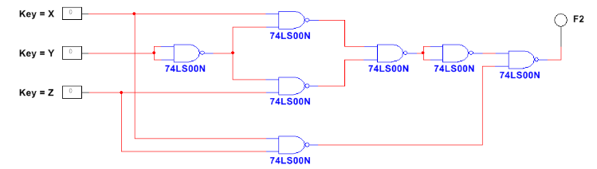
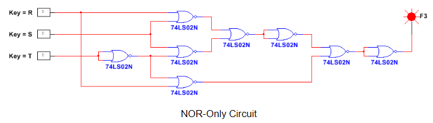

# Working With Multisim And Logic Circuits

Created 3 circuits in Multisim and outputted the results to get a truth table for each circuit design. The 3 circle demonstrates an AOI circuit, a NAND only circuit, and a NOR only circuit

## AOI Circuit ##

|A|B|C| |F1|
|-|-|-|-|-|
|0|0|0| |1|
|0|0|1| |0|
|0|1|0| |1|
|0|1|1| |1|
|1|0|0| |1|
|1|0|1| |0|
|1|1|0| |0|
|1|1|1| |1|

## NAND Only Circuit ##

|A|B|C| |F1|
|-|-|-|-|-|
|0|0|0| |0|
|0|0|1| |1|
|0|1|0| |0|
|0|1|1| |0|
|1|0|0| |1|
|1|0|1| |1|
|1|1|0| |0|
|1|1|1| |1|

## NOR Only Circuit

|A|B|C| |F1|
|-|-|-|-|-|
|0|0|0| |1|
|0|0|1| |1|
|0|1|0| |0|
|0|1|1| |1|
|1|0|0| |0|
|1|0|1| |1|
|1|1|0| |0|
|1|1|1| |0|