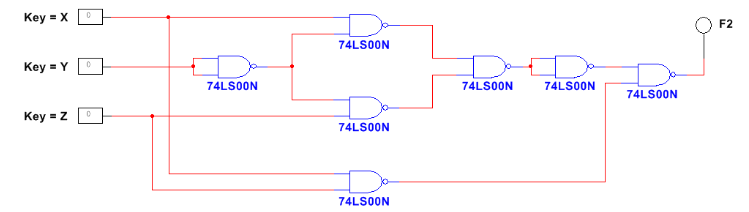

# Working With Multisim And Logic Circuits

## Objective ##
Objective of this project is to gain experience using the MultiSim Circuit Simulator. Through this project, three different types of combinational logic circuits will be simulated.
The first circuit will be an AOI circuit. It will only utilize AND, OR, and Inverters to build.
The second circuit will only use NAND logic gates to be built.
The third circuit will only use NOR logic gates to be built.
The truth table for each circuit will be completed and checked with the MultiSim Circuit Simulator.

## AOI Circuit ##

|A|B|C| |F1|
|-|-|-|-|-|
|0|0|0| |1|
|0|0|1| |0|
|0|1|0| |1|
|0|1|1| |1|
|1|0|0| |1|
|1|0|1| |0|
|1|1|0| |0|
|1|1|1| |1|

## NAND Only Circuit ##

|A|B|C| |F1|
|-|-|-|-|-|
|0|0|0| |0|
|0|0|1| |1|
|0|1|0| |0|
|0|1|1| |0|
|1|0|0| |1|
|1|0|1| |1|
|1|1|0| |0|
|1|1|1| |1|

## NOR Only Circuit

|A|B|C| |F1|
|-|-|-|-|-|
|0|0|0| |1|
|0|0|1| |1|
|0|1|0| |0|
|0|1|1| |1|
|1|0|0| |0|
|1|0|1| |1|
|1|1|0| |0|
|1|1|1| |0|